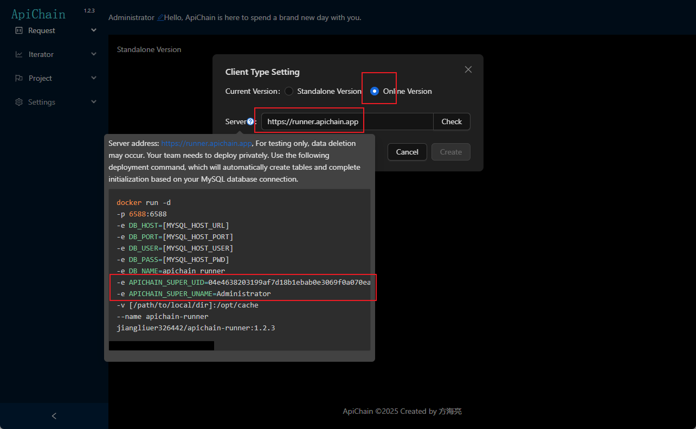
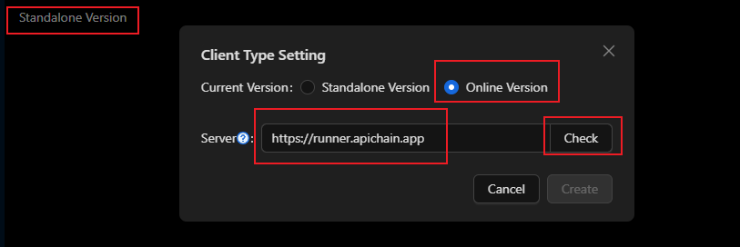
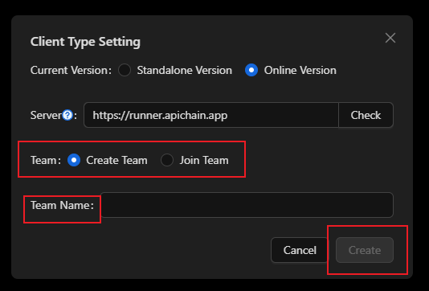

## Prerequisites

### MySQL Database

apichain团队版将您团队的数据存储在mysql中，目前测试mysql8 和 The Apichain team edition stores your team's data in MySQL. Currently, both MySQL 8 and MySQL 9 are supported. You can set up your own MySQL service and provide the MySQL connection account for Apichain. The following environment variables need to be configured:

- DB_HOST：The IP address of the database

- DB_PORT：The database port number

- DB_USER：The database username

- DB_PASS：The database password

- DB_NAME：The database name

The runner connects to the database using the above information and automatically creates tables on the first run.

### Administrator Account

The runner's administrator account has elevated privileges. To grant your account administrator privileges, configure the following environment variables:

- APICHAIN_SUPER_UID：Administrator UID
- APICHAIN_SUPER_UNAME：Administrator name

You can view specific account information in the software client by navigating to the settings pop-up, selecting the team edition, and clicking the question mark icon under the server section. This question mark tooltip also provides the team server address for testing, which is currently `https://runner.apichain.app`。



## Running Methods

### Docker (Recommended)

Based on the environment variables mentioned above, you also need to prepare a persistent storage directory mapped to the `/opt/cache` path in the container. This persistent directory is required to store runner logs, interface data converted to vector storage files, etc.

The complete Docker run command is as follows:

```shell
docker run -d 
-p 6588:6588 
-e DB_HOST=[MYSQL_HOST_URL]
-e DB_PORT=[MYSQL_HOST_PORT]
-e DB_USER=[MYSQL_HOST_USER]
-e DB_PASS=[MYSQL_HOST_PWD]
-e DB_NAME=apichain_runner
-e APICHAIN_SUPER_UID=04e4638203199af7d18b1ebab0e3069f0a070ea545bdef3486fac3918a9612d07c4ee18a64f41d8c6c75cb2aa5861559bf357abb11f750324ff8757189476877ef
-e APICHAIN_SUPER_UNAME=Administrator
-v [/path/to/local/dir]:/opt/cache
--name apichain-runner
jiangliuer326442/apichain-runner:1.2.3
```

The Docker image and version number above are just examples. You can find and copy the correct ones from the question mark tooltip in the image mentioned earlier.

### Windows Executable

You can configure the environment variables mentioned above as Windows environment variables. Download the Windows executable for the runner from the project's release menu. The file name is **runner-1.2.3-windows.zip**。

After downloading and extracting, you can directly run the **ApiChain_runner.exe** file. It will connect to MySQL and identify the administrator based on the configured environment variables. Related data will be cached in the `cache` folder in the current directory.

## Creating/Joining a Team



After running your team's runner, you can enter your team's runner address (default port is 6588) and click the Detect button to verify.



Once verified, you can click to create or join a team. To create a team, enter the team name. To join a team, select the team you wish to join.

## Additional Notes

After joining a team, your local data will automatically sync to the current team. If your current network cannot connect to your team, data will be stored locally. Once you reconnect to your team's network, local data will automatically undergo incremental synchronization.

After joining a team, network requests for specific projects in specific environments can be configured to be sent via the team server. The configuration method is as follows:


Click on project environment variables, find the environment variable with the key run_mode, and edit it. You can choose between client or runner. Client means the API request is sent locally, while runner means the API request is sent via a proxy.