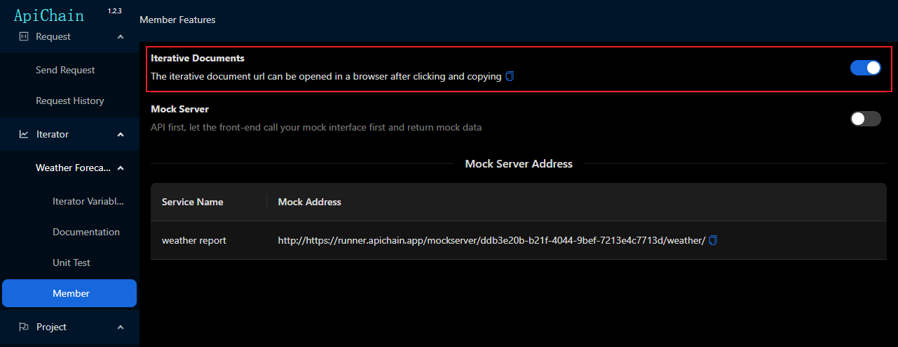

## Joining a Team

For security reasons, data is stored locally, and you need to deploy a runner on your local intranet. Refer to the tutorial here for deploying the runner. The following demonstrates the process using our test runner.


The first time you open it, a pop-up window for client type settings will appear. We select the online version and enter the test server address: `https://runner.apichain.app`

Click the "Check" button to verify if the server address is correct. Once the check passes, you can choose to create a team or join a team. Here, we created a team named `Weather Forecast Development Group` and successfully created the first team by clicking the "Create" button!

After successful creation, the app automatically restarts.


## Environment, Microservices, and Environment Variables

Click Settings -> Development Environment -> Add to create our development environment.


In the request, "client" represents the API request sent from our own computer, while "runner" indicates that the API request is sent through this runner (proxy). For specific details, refer to this documentation.

Click Settings -> Projects -> Add to create our project.


The configuration for the programming language Java and the development framework SpringBoot is set up to facilitate asking AI about issues related to this project. For details on how to use AI to ask questions about the project, [refer here](https://github.com/jiangliuer326442/ApiChain/wiki/3.AI-Assistant).

Under the project menu, you can see the project we just added. In the environment variables menu, set the host information for API access for this project in this environment. Click Projects -> Weather Forecast -> Environment Variables -> Select Environment (Local Environment) -> api_host -> Edit, and enter the address `https://pay.apichain.app/` (Note: The URL must start with `http://` or `https://` and end with `/`).


## Iteration

For our weather forecast project, the first iteration developed two interfaces:**Query the list of supported cities** 和 **Query future weather by city**，

First, create an iteration. Within this iteration, generate our interface documentation, write test cases, and finally, complete the iteration, merge the interfaces into the project, and go live!

Click Settings -> Version Iteration -> Add New.


We typically have one iteration per month, so my iteration name is **Weather Forecast 2406**. Since this iteration only involves the weather forecast project, I selected just one microservice. Usually, your iteration might involve multiple projects, so select all relevant ones. It’s okay to select too many or miss some, as you can modify them later in Settings -> Version Iteration. The iteration description is a Markdown document that will appear at the top of your iteration’s documentation. Everyone who wants to view the iteration’s interface documentation, including you, frontend developers, and testers, will see it.


-----

## Interface Testing

### Public Request Parameters

First, configure the public request parameters for our project. These parameters will be automatically included in all network requests for this project and can include path variables, parameters, headers, and body.


In Project -> Global Parameters -> Headers -> Batch Edit, paste the following content to automatically fill in all the header information. Click the save button to view the content above.

```
Content-Type: application/x-www-form-urlencoded
lang: en
```


### City List

To test whether the interface I wrote for querying the supported city list is correct: Request -> Send Request, select the project (Weather Forecast) -> select the environment (Local Environment) -> request method (POST) -> address (**test/weather-report/city-list**). Clicking the Send Request button will yield the response shown in the image below, indicating that the weather forecast query interface is functional. Additionally, we can see that the returned message is in Chinese, confirming that the language setting in our public header is effective!


Click the **Save** button above the **Send Request** button to save the interface, which has been successfully self-tested, to this iteration’s documentation. We need to inform others about the purpose of this interface (**querying the city list**), the meaning of the input fields (**public language configuration**), and the meaning of the returned fields. These details will be reflected in our iteration documentation. Additionally, specify which iteration this interface belongs to. If the iteration involves too many interfaces, we can organize them using folders (Weather Forecast) within the iteration pool to categorize the interfaces. Checking the "Export to Documentation" option will include this interface in the automatically generated iteration documentation.


The `data` field is annotated as **City List**，The ID parameter is of type **number** and annotated as **City ID**，The `name` parameter is of type string and annotated as **City Name**。

Clicking Save creates the first interface in this iteration—Query Supported City List!

### Query Weather

To verify the second interface, which queries weather by city name, this time we’ll send the network request from the iteration. The difference is that sending a request from the iteration uses environment variables that can include iteration-specific private variables, which take precedence over project environment variables and global environment variables. Go to Iteration -> Weather Forecast 2406 -> Documentation -> Send Request to open the request sending page. Select the project (Weather Forecast) -> select the environment (Local Environment) -> request method (POST) -> request address `test/weather-report/query-city-weather`. For the parameter `cityId`, enter **1**, which represents querying the weather for the city of **Ankara**. Sending the request yields the following response:


Click the Save button to store this interface in the iteration’s interface documentation. Title: **Query City Weather**, field `cityId` (**City ID, required**), and export to documentation. Configure the `cityId` as a **selector** to indicate that users can only select a city for the interface call, rather than entering an arbitrary ID.


In the selector, enter `Ankara:1`to indicate a city with ID 1 and name Ankara. The interface will transmit the ID 1, while displaying the name Ankara. Press Enter to confirm. The result is as follows:


In the iteration’s interface list, click the Send button to see the effect of sending the network request, as shown below:


### Document Writing

Let's take a look at our results: an iteration's interface documentation is now ready.

Under the iteration navigation, you can see the iteration we just created. By navigating to the Documentation menu, you can view the list of interfaces under this iteration. The list supports filtering by interface address, interface description, the project (microservice) the interface belongs to, and the folder within the iteration. Interface list management includes options for editing, deleting, and setting sort values.


Click the Export button in the bottom right corner to export the iteration's interfaces as an HTML or Markdown file for offline sharing. Alternatively, you can go to the Membership -> Iteration Documentation button to copy the documentation link for online sharing. (The documentation link address depends on the network of the server running the runner.)



Open the copied iteration documentation link in a browser to see the result as shown below:


### Writing Unit Test Cases and Executing Tests

In the previous section, while creating the interface documentation, we roughly tested that individual interfaces are functional. However, these interfaces do not exist in isolation. They need to be connected based on specific use cases, with their input parameters and return values linked according to certain rules. Through step-by-step assertions, we verify that the interface responses are correct and accurate in a given scenario.

For our weather forecast project, we confirmed that querying the weather for **Ankara** works fine. However, the actual use case requires that we can take any city from the supported city list and successfully query its weather. Only then can we ensure that our interfaces are truly usable.

Create a new unit test case: From the iteration menu, locate **Weather Forecast 2406** -> Unit Test, click Add, and name the test case **Query Weather for Any City**. Set the folder to Root Directory, then click Confirm.


In this unit test case, there are two steps:

1. Query the city list.
2. From the city list response, randomly select a city name as input to query that city's weather.

To ensure these steps execute smoothly, each step must include an assertion. If an assertion fails, the test case execution will stop, and it will indicate where the assertion failed, including the input parameters and the response, making it easier for you to troubleshoot and fix bugs.


From the unit test list, locate the newly added test case. Select the **Query Supported City List** interface from the **Weather Forecast** project, and use the default values for other settings.


Next, fill in the return assertion: The assertion for this interface requires that **the interface returns the correct status code**, meaning the `status` must be **1**


The final assertion expression is generated as shown below, supporting multiple assertions combined with an AND relationship. Click the **Add Step** button to add the first step of our first unit test.


We can try running the test case to see the results. Select the environment -> **Local Environment**, check the test case(s) to execute (multiple selections are supported, and selected test cases will run sequentially), and click the **Execute Test Case** button to run the selected test cases in order.


As shown in the image, the execution result is successful. You can also see the input parameters, response values, and the results of both sides of the assertion for each step and interface call, which helps with troubleshooting when a test fails.

-------

Continue with the Second Step: Use Any City from the City List to Query the Weather. Take ***\*any city\**** returned by the successful "Get City List" API as input, call the "Query Weather Forecast" API, and assert that the city returned by the API matches the input city (which originally came from the city list API).


Clearly, querying only one city (e.g., Ankara) does not meet the testing requirements. We need to ensure that ***\*any city\**** can be queried. Below is the high-energy section—pay close attention to the diagram:


The data source is the return value from the previous step (the city list query). We extract the `city` value from ***\*any element\**** in the array. ApiChain currently supports the following data sources:

* header  

  Keys in the headers we send to the API

* uri param 

  Keys in the URI path we send to the API (e.g., extracting `id`from a path like `/user/id_{id}.html`)

* body

  Body data sent to the API via POST

* param

  Parameters sent to the API via GET

* responseContent

  The main body of the API response (wrapped in the returned `body`)

* responseHeader

  Headers returned by the API

* responseCookie

  Cookies returned by the API (originally part of the headers; ApiChain extracts all cookies from the response headers and encapsulates them in an independent `responseCookie`data source for easier unit testing)

`result.*random().city`is the specific path for the parameter data source. `result`contains an array. We select any element from this array and use its **city** field as the input parameter. (Don’t worry—entering a "." will automatically trigger syntax suggestions, making it easier to input. You’ll see once you try it~)

*random() is a built-in function provided by ApiChain for array types, which selects a random element from the array. In addition to *random(), the built-in functions provided for array types include:

* *first() 

  Get the first element of an array. For example, after calling the data insertion API and then calling the data list API, the newly added data is often in the first position. We can retrieve this data and compare it with the recently inserted data to verify whether the insertion was successful.

* *last() 

  Get the last element of an array. For example, in paginated queries, the frontend sends the ID of the last element from the previously returned array, and based on this ID, the backend returns the next page of data to the frontend.

* *eval() 

  For non-array type data, a universal *eval() function is provided. This function requires users to write their own parameters. For instance, `result.*random().city.*eval('"location_" + $$')`would return not a string like "Shanghai" but a string like "location_Shanghai". The eval function can execute the content within the parameters as JavaScript code, where `$$`is a reference to the currently processed variable—in this example, the "city" variable.

Click OK, the request parameters have been filled in.

Now add a response assertion, which is similar to the previous step. 


As you can see, we have already added two steps. Next, we will execute our test case in the **local environment**.


------

## Iterating Unit Test Cases and Merging Interfaces into Projects for Regression Testing

Currently, our unit tests are conducted during iterations and are closed after the iteration goes live, making it impossible to retrieve the unit tests written for that iteration. When we need to perform regression testing for a project, we want to be able to find all the unit tests that have been executed for the project, re-run them sequentially, and determine whether the development of this version has caused issues with the project's existing functionality.

In the unit test extension button, there is an "Export to Project" button. Clicking it will copy the unit test to the project level. At the same time, the iteration environment variables will also be copied as unit test environment variables. Iteration environment variables are effective within that iteration, while unit test environment variables are effective for that specific unit test.


After the code goes live and the iteration is complete, we can go to Settings -> Version Iteration -> Iteration Status to close the iteration. This operation will automatically merge all interfaces developed in this iteration into the project.


At this point, you can execute the unit test cases for the weather forecast in the project. Multiple test cases can be selected and executed for regression testing.